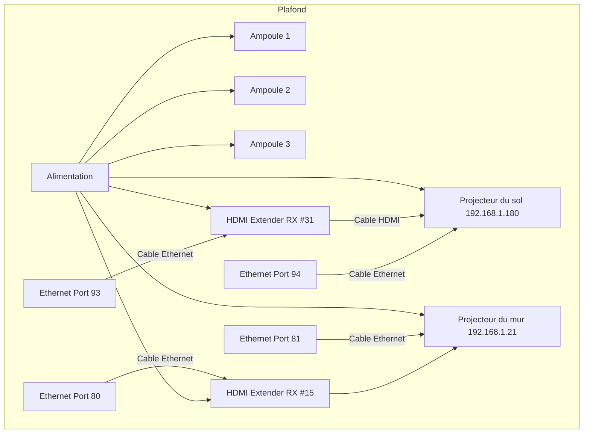
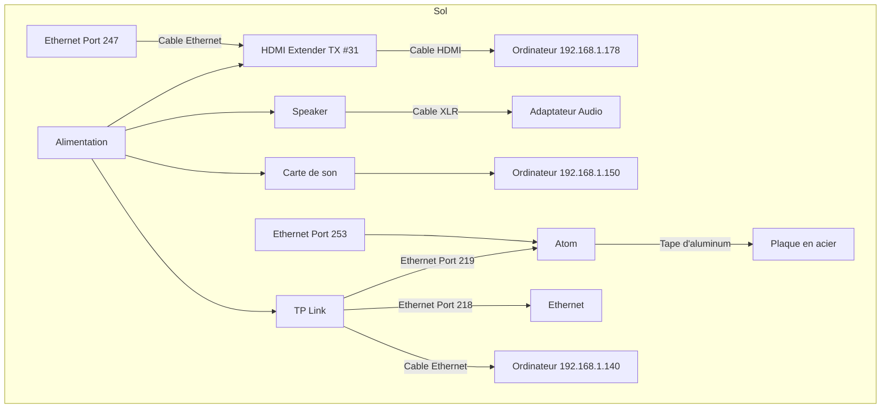

# Luminatura projection (Touch Designer)

## Pure Data - Touch Designer

Les données brutes sont transmises à TouchDesigner pour modifier la projection visuelle.
Lorsque l’utilisateur pose sa main sur la plaque, le visuel s’intensifie, renforçant l’immersion dans l'expérience interactive.
À l’inverse, lorsque la main est retirée, les effets visuels s’atténuent progressivement, accompagnant la fin du son et des lumières.

| Port  | Fonction                              |
| ----- | ------------------------------------- |
| 10002 | TouchDesigner - projection sur le sol |
| 10004 | TouchDesigner - projection sur le mur |

## Projection mur

## Projection sol

